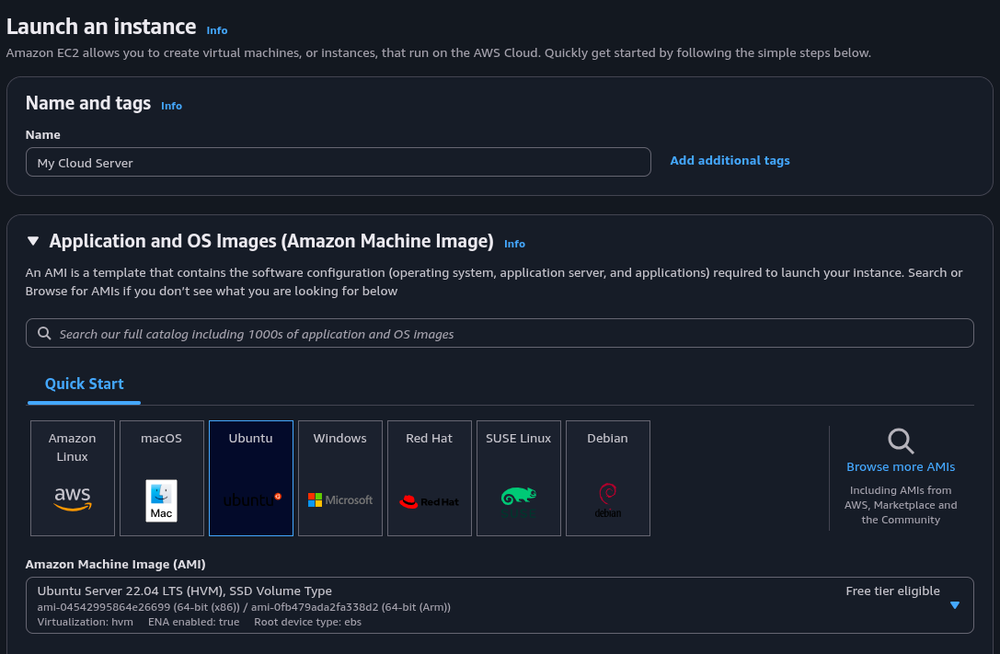
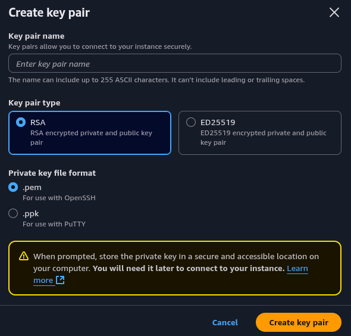
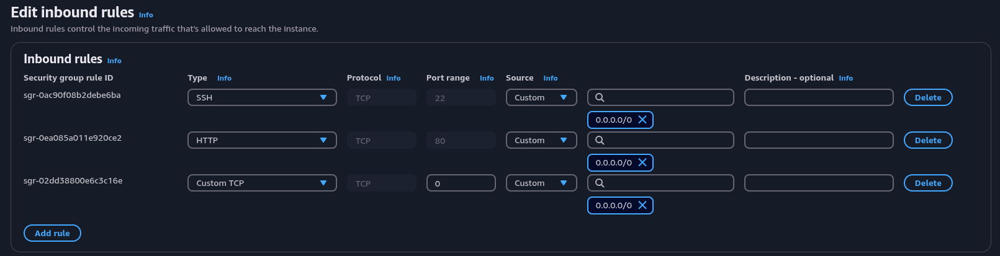

# Project 1
## Part 1: Local Server Configuration
### 📌 Objectives: Virtualized Server Security Setup

* Configure a **Bridge Network** in virtualization software (e.g., VirtualBox) to allow external network access
* Enable and configure both **SSH** and **FTP** services
* Set up **SSH access using public/private key authentication** for a specific user
* Test **FTP protocol functionality** using an FTP client or command line
* Install a **web server (Apache or Nginx)** and verify it works via a browser
* Set up a **firewall using UFW** (with iptables backend) and test its effectiveness
* Test firewall rules by **denying port 80**, verify web server becomes inaccessible, then **allow port 80** again to restore access
* Install and configure an **Intrusion Detection/Prevention System (Fail2Ban)** to protect services like SSH from brute-force attacks
* Verify Fail2Ban is running correctly and simulates blocking unauthorized attempts

---

### 1. Network Configuration

Configure bridge network settings.
> Go to Settings → Network → Adapter 1 → Attached to: *Bridged Adapter*

### 2. SSH Configuration

Steps for SSH setup with public/private key authentication:

1. Install SSH Server:

	```bash
	sudo apt update
	sudo apt install openssh-server -y
	sudo systemctl enable ssh
	sudo systemctl start ssh
	```

2. Edit `/etc/ssh/sshd_config`:

	```bash
	sudo vim /etc/ssh/sshd_config
	```
	Update or add the following:
	```ini
	PermitRootLogin no
	PasswordAuthentication no
	```

3. Restart the service:

	```bash
	sudo systemctl restart ssh
	```

4. Generate SSH key pair on client machine:

	```bash
	ssh-keygen -t rsa -b 4096
	```

5. Set the public key to the server `.ssh/authorized_keys`.
6. On server, verify:

	```bash
	cat /home/secureuser/.ssh/authorized_keys
	```

7. Verify IP with:

	```bash
	ip a
	```

8. Verify SSH connection using key authentication.

### 3. FTP Setup

1. Install FTP server (vsftpd):

	```bash
	sudo apt install vsftpd -y
	sudo systemctl enable vsftpd
	sudo systemctl start vsftpd
	```

2. Edit `/etc/vsftpd.conf`:

	```bash
	sudo vim /etc/vsftpd.conf
	```
	Ensure the following:
	```ini
	write_enable=YES
	local_enable=YES
	chroot_local_user=YES
	anonymous_enable=NO
	```

3. Restart the service:

	```bash
	sudo systemctl restart vsftpd
	```

4. Check status:

	```bash
	sudo systemctl status vsftpd
	```

5. Test FTP connection with a client:

	```bash
	ftp <server_ip>
	```

### 4. Web Server Installation (Nginx Example)

1. Nginx Installation:

	```bash
	sudo apt install nginx
	sudo systemctl enable nginx
	sudo systemctl start nginx
	```

2. Verify web server is working by accessing `http://<server_ip>`.

### 5. Firewall Configuration (UFW)

1. Install UFW:

	```bash
	sudo apt install ufw
	```
		
2. Configure basic rules:

	```bash
	sudo ufw allow 22	#SSH
	sudo ufw allow 21	#FTP
	sudo ufw allow 80	#HTTP
	sudo ufw enable
	```

3. Test firewall by denying port 80:

	```bash
	sudo ufw deny 80
	```

4. Verify website is inaccessible.
5. Re-enable port 80:

	```bash
	sudo ufw allow 80
	```

### 6. Fail2Ban (IDS/IPS) Setup

1. Install Fail2Ban:

	```bash
	sudo apt install fail2ban
	```

2. Start Fail2Ban:

	```bash
	sudo systemctl enable fail2ban
	sudo systemctl start fail2ban
	```

3. Copy configuration file:

	```bash
	sudo cp /etc/fail2ban/jail.conf /etc/fail2ban/jail.local
	```

4. Edit `/etc/fail2ban/jail.local`:

	```bash
	sudo vim /etc/fail2ban/jail.local
	```
	Ensure the following:
	```ini
	[sshd]
	enabled = true
	port	= ssh
	filter  = sshd
	logpath = /var/log/auth.log
	maxretry = 3
	```

5. Restart the service:

	```bash
	sudo systemctl restart fail2ban
	```

6. Check status:

	```bash
	sudo fail2ban-client status sshd
	```

7. Test Fail2Ban by attempting multiple failed SSH logins.

## Part 2: Cloud Based Server Configuration
### 📌 Objectives: Cloud Server Security Management (AWS)

* Deploy and manage a secure **cloud-based Linux server** (e.g., AWS EC2)
* Use **Linux at an administrator level** to configure system settings and enforce security policies
* Create and manage **user accounts** based on assigned roles (e.g., developer, analyst, admin)
* Set appropriate **file system permissions** and ownership to restrict access based on user responsibilities
* Harden the server and **secure SSH access**, including key-based authentication
* Defend against attacks such as **SSH brute-force attempts** using tools like Fail2Ban (testing without actual brute-forcing)
* Install, configure, and manually manage a **basic HTML-based website** using a web server (Nginx or Apache)
* Ensure all services are secured and monitored, following best practices for **cloud security and access control**

---

### 1. Instance Deployment

Steps for new Instance deplayment:

1. Go to AWS EC2 Dashboard → Launch Instance
2. Choose server distribution and version:

	

3. Click to `Create new key pair` and choose name, type and format:

	

4. Complete the setup by clicking "Launch instance".
5. Connect via SSH:

	```bash
	ssh ubuntu@your-ec2-public-ip -i /path/to/your-key
	```

### 2. Security Group Rules

Ensure the instance's security group allows inbound traffic:

1. Go to AWS EC2 Dashboard
2. Select your Instance
3. Navigate to Security → Security groups
4. Click on the security group name
5. Click `Edit inbound rules`
6. Add the following rules
	

### 3. SSH Hardening

Disable password authentication

1. Edit `/etc/ssh/sshd_config`:

	```bash
	sudo vim /etc/ssh/sshd_config
	```
	Update or add the following:
	```ini
	PermitRootLogin no
	PasswordAuthentication no
	```

2. Restart the service:

	```bash
	sudo systemctl restart ssh
	```

### 4. FTP Setup

1. Install FTP server (vsftpd):

	```bash
	sudo apt install vsftpd -y
	sudo systemctl enable vsftpd
	sudo systemctl start vsftpd
	```

2. Edit `/etc/vsftpd.conf`:

	```bash
	sudo vim /etc/vsftpd.conf
	```
	Ensure the following:
	```ini
	write_enable=YES
	local_enable=YES
	chroot_local_user=YES
	anonymous_enable=NO
	```

3. Restart the service:

	```bash
	sudo systemctl restart vsftpd
	```

4. Check status:

	```bash
	sudo systemctl status vsftpd
	```

5. Test FTP connection with a client:

	```bash
	ftp <server_ip>
	```

### 5. Web Server Installation (Nginx Example)

1. Nginx Installation:

	```bash
	sudo apt install nginx
	sudo systemctl enable nginx
	sudo systemctl start nginx
	```

2. Edit `/var/www/html/index.html`;

	```bash
	sudo vim /var/www/html/index.html
	```
	Add some HTML content you wanted:

3. Verify web server is working by accessing `http://<server_ip>`

### 6. Firewall Configuration (UFW)

1. Install UFW:

	```bash
	sudo apt install ufw
	```

2. Configure basic rules:

	```bash
	sudo ufw allow 22	#SSH
	sudo ufw allow 21	#FTP
	sudo ufw allow 80	#HTTP
	sudo ufw enable
	```

### 7. Fail2Ban (IDS/IPS) Setup

1. Install Fail2Ban:

	```bash
	sudo apt install fail2ban
	```

2. Start Fail2Ban:

	```bash
	sudo systemctl enable fail2ban
	sudo systemctl start fail2ban
	```

3. Check status:

	```bash
	sudo fail2ban-client status sshd
	```

## Bonus: VPN Server Configuration
### 📌 Objectives: VPN Server Setup

* Set up a secure **VPN server** (e.g., WireGuard or OpenVPN)
* Deploy a **HTTPS-enabled website** using **Apache/Nginx reverse proxy**
* Create a **cron-based backup system** with encryption
* Enable **automatic security updates and kernel patching**
* Automate server provisioning with **Ansible**
* Deploy a **Docker container** with the OWASP Juice Shop on port 3000, accessible from your local machine
* Write 3 essential **Bash scripts**:
  1. Automated System Audit
  2. Scheduled Backup with Compression and Encryption
  3. Service Health Checker and Auto-Restarter

---

### 1. VPN Server Setup in Virtual Box (WireGuard Example)

1. Install WireGuard:

	```bash
	sudo apt install wireguard -y
	sudo systemctl enable wg-quick@wg0
	sudo systemctl start wg-quick@wg0
	```

2. Adjust UFW:

	```bash
	sudo ufw allow 51820
	```

3. Generate private/public keys on the server and on the client:

	```bash
	wg genkey | tee privatekey | wg pubkey > publickey
	```

4. Configure `/etc/wireguard/wg0.conf` with private/public keys and peers:

	```bash
	sudo vim /etc/wireguard/wg0.conf
	```

	Add the following for the server:

	```ini
	[Interface]
	PrivateKey = <server-private-key>
	Address = 10.0.0.1/24
	ListenPort = 51820
		
	[Peer]
	PublicKey = <client-public-key>
	AllowedIPs = 10.0.0.2/32
	```

	Add the following for the client:

	```ini
	[Interface]
	PrivateKey = <client-private-key>
	Address = 10.0.0.2/24
	ListenPort = 51820
		
	[Peer]
	PublicKey = <server-public-key>
	Endpoint = <server-public-ip>:51820
	AllowedIPs = 0.0.0.0/0
	```

5. Restart the service:

	```bash
	sudo systemctl restart wg-quick@wg0
	```

6. Check status:

	```bash
	sudo systemctl status wg-quick@wg0
	```

7. Verify that WireGuard VPN is working:

	```bash
	sudo wg
	```

### 2. HTTPS Reverse Proxy in AWS EC2

1. Install OpenSSL:

	```bash
	sudo apt update
	sudo apt install nginx openssl -y
	```

2. Create the SSL directory and generate a certificate:

	```bash
	sudo mkdir -p /etc/nginx/ssl
	sudo openssl req -x509 -nodes -days 365 -newkey rsa:2048 \
	  -keyout /etc/nginx/ssl/self.key \
	  -out /etc/nginx/ssl/self.crt
	```

3. Create a new Nginx configuration:

	```bash
	sudo vim /etc/nginx/sites-available/default
	```

	Paste the following:

	```ini
	server {
		listen 80;
		server_name _;

		return 301 https://$host$request_uri;
	}

	server {
		listen 443 ssl;
		server_name _;

		ssl_certificate /etc/nginx/ssl/self.crt;
		ssl_certificate_key /etc/nginx/ssl/self.key;

		location / {
			proxy_pass http://localhost:3000;
			proxy_set_header Host $host;
			proxy_set_header X-Real-IP $remote_addr;
		}
	}
	```

4. Enable the configuration and reload Nginx:

	```bash
	sudo nginx -t
	sudo systemctl reload nginx
	```

5. Add Port 443 to AWS EC2 Security Group:

	* EC2 ➝ Instances ➝ Select your instance ➝ Security ➝ Edit Inbound Rules
	* Add rule:

	  * **Type:** HTTPS
	  * **Port:** 443
	  * **Source:** Anywhere (or your IP)

6. Allow HTTPS through UFW:

	```bash
	sudo ufw allow 443
	```

7. Verify web server is working by accessing `https://<your-ec2-public-ip>`.

8. Optional: Make it a True Reverse Proxy:

	You can proxy Nginx traffic to a service running on `localhost:3000`, such as:
	* Node.js app
	* OWASP Juice Shop (Docker container)
	* Any other Dockerized web app

	> **Important:** Make sure the backend service is running before accessing it via Nginx.
	> If it's not running, you'll get a **502 Bad Gateway** error — this means Nginx is working, but the target service is unavailable.

### 6. Docker + OWASP Juice Shop

1. Install Docker:

	```bash
	sudo apt install docker.io
	```

2. Pull and run:

	```bash
	docker run -d -p 3000:3000 bkimminich/juice-shop
	```

3. Access from host at: `http://<server_ip>:3000`
